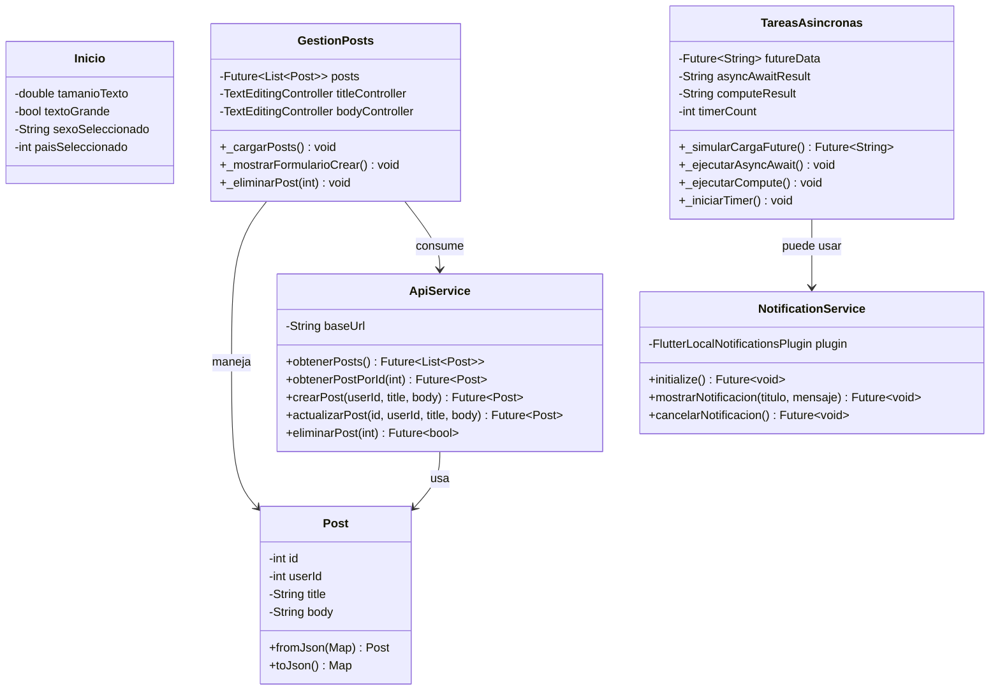

# Proyecto Flutter - Aplicación Completa

Una aplicación Flutter que demuestra conceptos avanzados de desarrollo, incluyendo:
- ✅ Autenticación con bcrypt
- ✅ Lectura de archivos locales
- ✅ Consumo de APIs REST (CRUD completo)
- ✅ Operaciones asincrónicas (FutureBuilder, async/await, Isolate, Timer.periodic)
- ✅ Notificaciones locales
- ✅ Navegación entre pantallas
- ✅ Controles Cupertino personalizados

## Arquitectura de la Aplicación

### Estructura de Directorios

```
lib/
├── main.dart                      # Punto de entrada
├── inicio.dart                    # Pantalla principal (Hub)
├── terminos.dart                  # Términos y condiciones
├── lectura_archivo.dart           # Lectura de archivos con FutureBuilder
├── gestion_posts.dart             # CRUD de posts (API)
├── tareas_asincronas.dart         # Demostración de 4 formas asincrónicas
├── pantalla_notificaciones.dart   # Centro de notificaciones
├── data/
│   ├── post_model.dart            # Modelo de Post
│   ├── api_service.dart           # Servicio REST
│   └── usuario_database.dart      # Base de datos SQLite
└── services/
    └── notification_service.dart  # Servicio de notificaciones

assets/
└── datos.txt                       # Archivo de datos de ejemplo
```

## Diagrama de Clases



## Diagrama de Flujo de la Aplicación

```mermaid
graph TD
    A[Inicio: main.dart] --> B[Autenticación: Login]
    B -->|Usuario/Contraseña correcto| C[Pantalla Principal: Inicio]
    B -->|Error| D[Mostrar Error]
    D --> B

    C -->|Gestionar Posts| E[Gestión CRUD de Posts]
    E -->|GET| F[Lista de Posts]
    E -->|POST| G[Crear Post]
    E -->|PUT| H[Actualizar Post]
    E -->|DELETE| I[Eliminar Post]

    C -->|Leer Archivo| J[Lectura de Archivo Local]
    J -->|FutureBuilder| K[Mostrar Contenido]

    C -->|Tareas Asincrónicas| L[Demostración Async]
    L --> M[FutureBuilder]
    L --> N[Async/Await]
    L --> O[Compute Isolate]
    L --> P[Timer.periodic]

    C -->|Notificaciones| Q[Centro de Notificaciones]
    Q -->|Enviar| R[FlutterLocalNotifications]

    C -->|Términos| S[Términos y Condiciones]

    E --> Q : Notificar éxito/error
    M --> Q : Notificar al completar
    N --> Q : Notificar resultado
```

## Servicios Principales

### 1. Lectura de Archivo Local (assets/datos.txt)
- **Pantalla:** `LecturaArchivo`
- **Técnica:** `FutureBuilder`
- **Descripción:** Lee un archivo desde assets de forma asincrónica

### 2. CRUD con API (JSONPlaceholder)
- **Pantalla:** `GestionPosts`
- **Servicio:** `ApiService`
- **Técnica:** HTTP GET, POST, PUT, DELETE
- **Base URL:** `https://jsonplaceholder.typicode.com`

### 3. Operaciones Asincrónicas (4 Formas)
- **Pantalla:** `TareasAsincronas`
- **Formas:**
  1. **FutureBuilder:** Para cargar datos
  2. **Async/Await:** Para operaciones de usuario
  3. **Compute/Isolate:** Para tareas pesadas
  4. **Timer.periodic:** Para actualizaciones continuas

### 4. Notificaciones Locales
- **Servicio:** `NotificationService`
- **Pantalla:** `PantallaNotificaciones`
- **Características:**
  - Inicialización al arrancar la app
  - Soporte para Android e iOS
  - Gestión de permisos
  - Múltiples tipos de notificaciones

## Credenciales de Acceso

```
Usuario: admin
Contraseña: admin123 (se valida con bcrypt)
```

## Dependencias Principales

```yaml
dependencies:
  flutter:
    sdk: flutter
  bcrypt: ^1.1.3              # Encriptación de contraseñas
  http: ^1.6.0                # Consumo de APIs REST
  flutter_local_notifications: ^22.0.1  # Notificaciones locales
  get: ^4.6.6                 # Gestión de estado (disponible para expansión)
```

## Características Implementadas

### ✅ Autenticación
- Login con validación de usuario y contraseña
- Contraseña encriptada con bcrypt
- Validación en tiempo real

### ✅ Base de Datos
- SQLite integrado (en `data/usuario_database.dart`)
- Estructura lista para expandir

### ✅ API REST
- Consumo de JSONPlaceholder
- Operaciones CRUD completas
- Manejo de errores y timeouts

### ✅ Interfaz de Usuario
- Tema oscuro Cupertino
- Navegación fluida
- Controles personalizados
- SafeArea y SingleChildScrollView

### ✅ Asincronía
- FutureBuilder para UI reactiva
- Async/await para controlar flujos
- Isolate para operaciones pesadas
- Timer para actualizaciones periódicas

### ✅ Notificaciones
- Sistema de notificaciones locales
- Múltiples canales configurables
- Soporte multiplataforma (Android/iOS)

## Cómo Usar

### 1. Clonar y Configurar
```bash
git clone <repo>
cd proyecto1
flutter pub get
```

### 2. Ejecutar la Aplicación
```bash
flutter run
```

### 3. Navegar por las Funcionalidades
1. **Login:** Ingresa `admin` / `admin123`
2. **Gestionar Posts:** Ver, crear, actualizar, eliminar posts
3. **Leer Archivo:** Ver contenido de assets/datos.txt
4. **Tareas Asincrónicas:** Experimentar con 4 formas diferentes
5. **Notificaciones:** Enviar notificaciones de prueba
6. **Términos:** Leer términos y condiciones

## Estructura del Código

### Modelo Post
```dart
class Post {
  final int id;
  final int userId;
  final String title;
  final String body;
}
```

### Servicio API
```dart
class ApiService {
  static const String baseUrl = 'https://jsonplaceholder.typicode.com';
  // Métodos: GET, POST, PUT, DELETE
}
```

### Servicio de Notificaciones
```dart
class NotificationService {
  static Future<void> initialize()
  static Future<void> mostrarNotificacion()
  static Future<void> cancelarNotificacion()
}
```

## Pantallas de la Aplicación

```
┌─────────────────────────┐
│   Login (main.dart)     │
└────────────┬────────────┘
             │
             ├──► Términos
             │
             ├──► Inicio (Hub Central)
             │    ├──► Gestionar Posts (CRUD)
             │    ├──► Leer Archivo Local
             │    ├──► Tareas Asincrónicas
             │    ├──► Centro de Notificaciones
             │    ├──► SQLite (expandible)
             │    ├──► Controles Cupertino
             │    └──► Más...
```

## Próximas Expansiones

- [ ] Autenticación con Firebase
- [ ] Almacenamiento en la nube
- [ ] Sincronización offline-first
- [ ] Análisis y reportes
- [ ] Tests unitarios y de integración
- [ ] Internacionalización (i18n)

## Notas Importantes

- La API JSONPlaceholder es de lectura principalmente (los cambios no persisten)
- Las notificaciones requieren permisos específicos en Android 13+
- El archivo de datos está en assets y se carga en tiempo de compilación

## Licencia

Este proyecto es de código abierto y está disponible bajo la licencia MIT.

---

**Versión:** 0.1.0  
**Última actualización:** 2026-07-13
