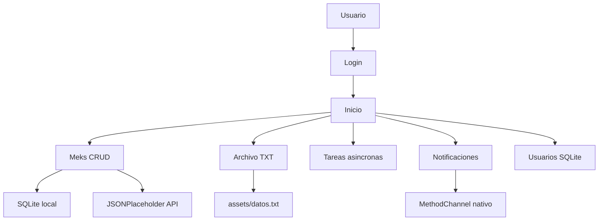
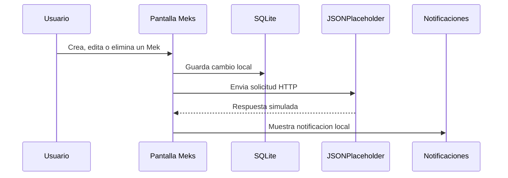

# Proyecto Flutter - Programacion Movil

Aplicacion movil y de escritorio desarrollada en Flutter para la materia de
Programacion Movil. El proyecto integra interfaz estilo Cupertino, login,
SQLite, consumo de API REST, lectura de archivos, tareas asincronas,
notificaciones locales y CRUD completo.

## Datos del proyecto

| Dato | Informacion |
| --- | --- |
| Autor | Antonio de Jesus Gaytan Rodriguez |
| Carrera | Ingenieria en Tecnologias de la Informacion |
| Generacion | 23 |
| Materia | Programacion Movil |
| Proyecto | Aplicacion Flutter con persistencia local, API REST y notificaciones |
| Version | 0.1.0+1 |
| Plataforma probada | Windows |

## Descripcion breve

Este proyecto demuestra el uso de Flutter para construir una aplicacion con
varias funciones comunes en el desarrollo movil: autenticacion, navegacion entre
pantallas, manejo de datos locales con SQLite, consumo de servicios web,
programacion asincrona, lectura de archivos internos y notificaciones locales.

La app usa una interfaz basada en componentes Cupertino para simular una
experiencia cercana a iOS, pero fue preparada y probada principalmente en
Windows como aplicacion de escritorio Flutter.

## Identidad del proyecto

El proyecto funciona como una app academica de practica integral. Su objetivo no
es resolver una sola pantalla aislada, sino reunir diferentes temas vistos en la
materia en una misma aplicacion funcional:

- Autenticacion de usuarios.
- Registro de usuarios en base de datos local.
- Modulo CRUD llamado "Meks".
- Sincronizacion simulada con una API REST.
- Manejo de imagenes.
- Lectura de archivo TXT desde assets.
- Ejemplos de programacion asincrona.
- Notificaciones locales.
- Documentacion con diagramas UML.

## Credenciales de prueba

```text
Usuario: admin
Password: admin123
```

Tambien se pueden crear usuarios nuevos desde la pantalla de login. Los usuarios
registrados se guardan en SQLite.

## Caracteristicas principales

- Login con usuario fijo y validacion de contrasena con `bcrypt`.
- Registro de nuevos usuarios en SQLite.
- Menu principal tipo `CupertinoActionSheet`.
- Interfaz estilo Cupertino.
- Lectura del archivo local `assets/datos.txt`.
- CRUD local de "Meks" con SQLite.
- Consumo de API REST usando JSONPlaceholder.
- Crear, consultar, editar y eliminar registros.
- Manejo de imagenes con `image_picker`.
- Notificaciones locales al crear, editar o eliminar registros.
- Canal nativo con `MethodChannel` para notificaciones en Windows y Android.
- Pantalla independiente para probar notificaciones.
- Pantalla de tareas asincronas con `FutureBuilder`, `async/await`,
  `Isolate.run` y `Timer.periodic`.
- Diagramas en Mermaid, PlantUML y SVG.

## Herramientas usadas

### Desarrollo

- Flutter SDK.
- Dart SDK.
- Git.
- GitHub.
- Windows como entorno de prueba.
- Visual Studio con componentes de escritorio C++ para compilar en Windows.
- Android Studio y Android SDK para soporte Android.
- Visual Studio Code como editor opcional.

### Extensiones recomendadas

Estas extensiones ayudan a trabajar el proyecto si se usa Visual Studio Code,
pero no son obligatorias para correrlo desde terminal:

- Flutter.
- Dart.
- GitLens.
- Error Lens.
- PlantUML.
- Markdown Preview Mermaid Support.

### Diseno, documentacion e investigacion

- Markdown para documentacion.
- Mermaid para diagramas en GitHub.
- PlantUML para diagrama de clases.
- JSONPlaceholder como API REST de prueba.
- Documentacion oficial de Flutter: https://docs.flutter.dev/
- Documentacion de Dart: https://dart.dev/guides
- Paquetes de pub.dev: https://pub.dev/

### Inteligencias artificiales

- ChatGPT/Codex para apoyo en documentacion, revision de estructura y mejora del
  README.
- GitHub Copilot para sugerencias de codigo y autocompletado.

## Tecnologias y dependencias

Dependencias principales definidas en `pubspec.yaml`:

```yaml
dependencies:
  flutter:
    sdk: flutter
  cupertino_icons: ^1.0.8
  get: ^4.6.6
  bcrypt: ^1.1.3
  path: ^1.9.1
  sqflite: ^2.4.2
  sqflite_common_ffi: ^2.4.0+3
  http: ^1.6.0
  image_picker: ^1.1.2
  path_provider: ^2.1.5
```

## Prerequisitos

Para compilarlo y correrlo en Windows se necesita tener instalado Flutter para
Windows:

- Guia oficial: https://docs.flutter.dev/get-started/install/windows/desktop

Tambien se requiere:

- Git: https://git-scm.com/downloads
- Visual Studio 2022 con "Desktop development with C++":
  https://visualstudio.microsoft.com/downloads/
- Un navegador o terminal para ejecutar comandos.

Para revisar que Flutter este bien instalado:

```bash
flutter doctor
```

Si `flutter doctor` muestra problemas, se deben resolver antes de compilar.

## Como correr el proyecto

No es obligatorio usar Visual Studio Code. El proyecto se puede ejecutar desde
PowerShell, CMD, Windows Terminal o cualquier terminal compatible.

Desde la carpeta del proyecto:

```bash
cd proyecto1
flutter pub get
```

### Correr en Windows

Esta es la plataforma donde el proyecto fue probado.

```bash
flutter run -d windows
```

### Compilar ejecutable de Windows

```bash
flutter build windows
```

El ejecutable generado queda dentro de:

```text
build/windows/x64/runner/Release/
```

### Correr en Android

El proyecto contiene carpeta Android y puede ejecutarse en un emulador o
dispositivo fisico si el entorno Android esta configurado.

Ver dispositivos disponibles:

```bash
flutter devices
```

Ejecutar en un dispositivo Android:

```bash
flutter run -d android
```

O usando el identificador exacto mostrado por `flutter devices`:

```bash
flutter run -d ID_DEL_DISPOSITIVO
```

Nota: la plataforma confirmada como probada para esta entrega es Windows.
Android queda preparado en el proyecto, pero debe validarse en una computadora
con Android SDK, emulador o telefono conectado.

## Menu de la app

Desde la pantalla principal se abre un menu en la esquina superior derecha con
acceso a:

- Meks.
- Archivo TXT.
- Tareas asincronas.
- Notificaciones.
- Usuarios SQLite.

## Estructura principal

```text
lib/
  main.dart
  inicio.dart
  gestion_posts.dart
  lectura_archivo.dart
  pantalla_notificaciones.dart
  tareas_asincronas.dart
  terminos.dart
  data/
    api_service.dart
    mek_database.dart
    post_model.dart
    usuario_database.dart
  services/
    notification_service.dart

assets/
  datos.txt

docs/
  guion_demo.md
  uml.md
  diagrama_clases.puml
  uml_diagrama.svg
```

## Descripcion de pantallas

### Login

Archivo: `lib/main.dart`

Permite iniciar sesion con el usuario administrador o con usuarios registrados
en SQLite. Incluye terminos y condiciones antes del acceso.

### Inicio

Archivo: `lib/inicio.dart`

Pantalla principal con controles de practica: slider, switch, radio buttons,
picker y menu de navegacion.

### Meks

Archivo: `lib/gestion_posts.dart`

Modulo CRUD donde se pueden agregar, editar, consultar y eliminar registros.
Cada accion se guarda localmente en SQLite y tambien intenta sincronizarse con
JSONPlaceholder.

### Archivo TXT

Archivo: `lib/lectura_archivo.dart`

Lee informacion desde:

```text
assets/datos.txt
```

### Tareas asincronas

Archivo: `lib/tareas_asincronas.dart`

Incluye ejemplos de:

- `FutureBuilder`.
- `async/await`.
- `Isolate.run`.
- `Timer.periodic`.

### Notificaciones

Archivo: `lib/pantalla_notificaciones.dart`

Permite probar diferentes notificaciones desde botones. El servicio principal se
encuentra en:

```text
lib/services/notification_service.dart
```

El canal nativo usado es:

```text
proyecto1/notificaciones
```

Implementaciones nativas relacionadas:

```text
windows/runner/flutter_window.cpp
android/app/src/main/kotlin/com/example/proyecto1/MainActivity.kt
```

## Base de datos local

El proyecto usa SQLite para persistencia local.

Archivos principales:

- `lib/data/usuario_database.dart`
- `lib/data/mek_database.dart`

Tablas principales:

- `usuarios`
- `meks`

En escritorio se inicializa `sqflite_common_ffi` para permitir el uso de SQLite
en Windows, Linux y macOS.

## API REST

Archivo:

```text
lib/data/api_service.dart
```

API usada:

```text
https://jsonplaceholder.typicode.com
```

Metodos implementados:

- `obtenerPosts`
- `obtenerPostPorId`
- `crearPost`
- `actualizarPost`
- `eliminarPost`

JSONPlaceholder simula operaciones de API. Por eso, las creaciones,
actualizaciones y eliminaciones responden como si fueran exitosas, pero no se
guardan permanentemente en el servidor.

## Diagramas

### Arquitectura general



### Flujo de datos del CRUD



### Diagrama UML

El diagrama de clases esta documentado en:

```text
docs/uml.md
```

Tambien hay version PlantUML:

```text
docs/diagrama_clases.puml
```

Y version SVG:

```text
docs/uml_diagrama.svg
```

## Valor agregado

- Integra varios temas de la materia en una sola app.
- Tiene persistencia real con SQLite.
- Usa una API REST externa para practicar peticiones HTTP.
- Incluye documentacion tecnica y diagramas.
- Usa canales nativos para conectar Flutter con codigo especifico de plataforma.
- Incluye una pantalla de tareas asincronas para explicar conceptos importantes
  del desarrollo movil moderno.
- Se puede ejecutar desde terminal, sin depender de un editor especifico.

## Comandos utiles

Instalar dependencias:

```bash
flutter pub get
```

Analizar el proyecto:

```bash
flutter analyze
```

Ejecutar pruebas:

```bash
flutter test
```

Limpiar compilaciones:

```bash
flutter clean
```

Volver a descargar dependencias:

```bash
flutter pub get
```

## Subir cambios a GitHub

Desde la carpeta del repositorio:

```bash
git status
git add .
git commit -m "Actualizar proyecto Flutter"
git push origin main
```

Si GitHub tiene cambios que no estan en la computadora:

```bash
git pull origin main --allow-unrelated-histories
git push origin main
```

## Nota sobre iPhone

El proyecto se puede subir a GitHub desde Windows, pero para compilarlo y
probarlo directamente en iPhone se necesita una Mac con Xcode o un servicio de
compilacion iOS en la nube. Desde Windows no se puede compilar iOS de forma
directa.

## Estado del proyecto

Proyecto academico funcional para entrega de Programacion Movil. La plataforma
validada en esta entrega es Windows. El codigo conserva soporte de estructura
Flutter multiplataforma, pero cualquier plataforma adicional debe probarse antes
de marcarse como validada.
