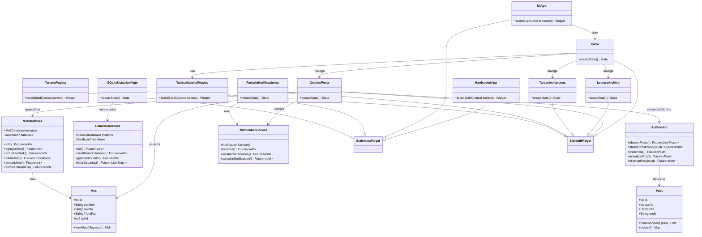

# Diagrama de clases

Este diagrama muestra las clases principales del proyecto Flutter.

```mermaid
classDiagram
  class HardcodedApp {
    +build(BuildContext context) Widget
  }

  class MiApp {
    +build(BuildContext context) Widget
  }

  class Inicio {
    +createState() State
  }

  class GestionPosts {
    +createState() State
  }

  class LecturaArchivo {
    +createState() State
  }

  class TareasAsincronas {
    +createState() State
  }

  class PantallaNotificaciones {
    +createState() State
  }

  class SQLiteUsuariosPage {
    +createState() State
  }

  class TarjetaMundialMexico {
    +build(BuildContext context) Widget
  }

  class TerceraPagina {
    +build(BuildContext context) Widget
  }

  class Mek {
    +int id
    +String nombre
    +String apodo
    +String? fotoPath
    +int? apiId
    +fromMap(Map map) Mek
  }

  class Post {
    +int id
    +int userId
    +String title
    +String body
    +fromJson(Map json) Post
    +toJson() Map
  }

  class MekDatabase {
    +MekDatabase instance
    -Database? database
    +init() Future~void~
    +agregarMek() Future~int~
    +actualizarMek() Future~void~
    +listarMeks() Future~List~Mek~~
    +contarMeks() Future~int~
    +eliminarMek(int id) Future~void~
  }

  class UsuarioDatabase {
    +UsuarioDatabase instance
    -Database? database
    +init() Future~void~
    +seedDemoUsuarios() Future~void~
    +guardarUsuario() Future~int~
    +listarUsuarios() Future~List~Map~~
  }

  class ApiService {
    +obtenerPosts() Future~List~Post~~
    +obtenerPostPorId(int id) Future~Post~
    +crearPost() Future~Post~
    +actualizarPost() Future~Post~
    +eliminarPost(int id) Future~bool~
  }

  class NotificationService {
    +NotificationService()
    +initialize() Future~void~
    +mostrarNotificacion() Future~void~
    +cancelarNotificacion() Future~void~
  }

  HardcodedApp --|> StatelessWidget
  MiApp --|> StatelessWidget
  Inicio --|> StatefulWidget
  GestionPosts --|> StatefulWidget
  LecturaArchivo --|> StatefulWidget
  TareasAsincronas --|> StatefulWidget
  PantallaNotificaciones --|> StatefulWidget
  SQLiteUsuariosPage --|> StatefulWidget
  TarjetaMundialMexico --|> StatelessWidget
  TerceraPagina --|> StatelessWidget

  MiApp --> Inicio : abre
  Inicio --> GestionPosts : navega
  Inicio --> LecturaArchivo : navega
  Inicio --> TareasAsincronas : navega
  Inicio --> TarjetaMundialMexico : usa

  GestionPosts --> MekDatabase : guarda/lee
  GestionPosts --> ApiService : crea/edita/elimina
  GestionPosts --> NotificationService : notifica
  GestionPosts --> Mek : muestra

  ApiService --> Post : devuelve
  MekDatabase --> Mek : crea
  SQLiteUsuariosPage --> UsuarioDatabase : lee usuarios
  PantallaNotificaciones --> NotificationService : usa
```

